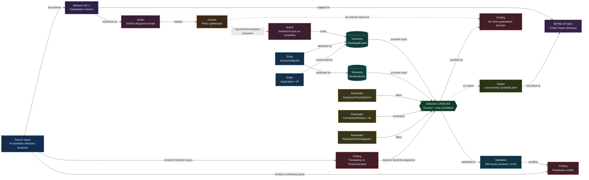
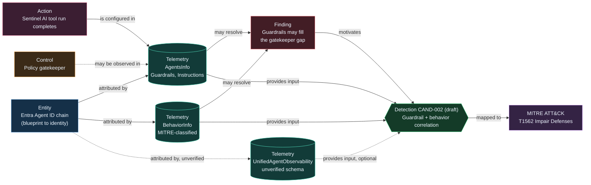

# PuzzleMask Evidence Provenance Graph

> ⚠ **NOT VALIDATED AGAINST TENANT DATA.** This graph reflects the source report and public Microsoft documentation only — no query has been run against a live tenant. Treat every "high confidence" label as *well-documented*, not *confirmed*.

This graph traces the report's claims from source evidence through the hypothesized agent action, observed telemetry, correlation logic, validation, and MITRE ATT&CK mapping. Solid arrows represent an observed or explicitly asserted relationship. Dashed arrows represent a conditional or unobserved relationship.

**This is the "Evidence Provenance" mode** (why do we believe it's suspicious). For the complementary "Action Provenance" mode (what did the agent actually do), see [`action-provenance-finance-agent.json`](./action-provenance-finance-agent.json), loadable in the same viewer -- see the [README](./README.md#two-graph-modes) for details.

## Agent-observability enrichment (proposed, unverified)

This second diagram shows how `AgentsInfo` and `BehaviorInfo` extend the original graph. Dashed arrows mark relationships that depend on an unverified join-key assumption.

## Provenance interpretation

1. The source directly supports the existence and intent of behavior cluster `BC-1`.
2. `CloudAppEvents` directly observes completion of a Sentinel AI tool run, but it does not directly observe whether a policy gatekeeper allowed, blocked, or was bypassed by the prompt.
3. `AlertEvidence` supplies later security evidence. The query correlates the two tables by `AccountObjectId` and time, not by a unique agent session or causal identifier.
4. The correlation is therefore an investigation hypothesis, not proof that the prompt caused the downstream alert.
5. A 14-day replay returned zero hits. This measures low historical volume but does not establish true-positive effectiveness.
6. The conservative deployment status is **requires tuning** because all three `let` parameters are marked as placeholders and the report explicitly says to complete them before deployment.
7. Microsoft Sentinel Log Analytics uses `TimeGenerated` in the official `CloudAppEvents` and `AlertEvidence` schemas. Use [`detections/CAND-001-sentinel.kql`](./detections/CAND-001-sentinel.kql) in Sentinel rather than the report's `Timestamp`-based query.

## Why AgentsInfo and BehaviorInfo were not in the original graph

The original graph modeled exactly what the source report cited: `CloudAppEvents` and `AlertEvidence`. The report's authors stated a gap they could not close: *"no explicit gatekeeper decision field was confirmed."* They did not reference `AgentsInfo`, `BehaviorInfo`, `UnifiedAgentObservability`, or the Entra Agent ID identity tables (`EntraAgentIdentityBlueprints`, `EntraAgentIdentityBlueprintPrincipals`, `EntraAgentIdentities`, `EntraAgentUsers`) at all, so the graph could not include telemetry the source never mentioned.

Those tables exist and, per official Microsoft Learn documentation:

- **`AgentsInfo`** (replacing `AIAgentsInfo`, which is retired July 1, 2026) inventories AI agents and includes a **`Guardrails`** column — "guardrails attached to the agent and their coverage" — plus `Instructions` (the agent's system prompt), `Permissions`, `DeclaredTools`, `McpServers`, and an `ObservabilityId` correlation key.
- **`BehaviorInfo`** (preview; requires Defender for Cloud Apps + UEBA) provides pre-correlated behaviors already classified against MITRE ATT&CK (`Categories`, `AttackTechniques`), keyed by the same `AccountObjectId` used in CAND-001.
- The **Entra Agent ID** identity model (blueprint → blueprint principal → agent identity → optional agent user) is Microsoft's first-party identity chain for agents, confirmed in Microsoft Learn's Entra Agent ID documentation.
- **`UnifiedAgentObservability`** was observed directly in your tenant's schema browser under "Agent Observability," but its column-level schema was not found in a first-party Microsoft Learn reference at authoring time. Treat it as **unverified** until you confirm its columns in your own tenant.

This means `AgentsInfo.Guardrails` is a plausible, first-party candidate for the exact signal the original report said it lacked. The graph now models this as `finding-guardrail-signal` and proposes `detection-cand002` in [`detections/CAND-002-guardrail-enriched.kql`](./detections/CAND-002-guardrail-enriched.kql) — a **draft, not a validated detection** — that correlates weakly-guarded agents (via `AgentsInfo`) with MITRE-classified behaviors (via `BehaviorInfo`) instead of a blind account-and-time join against raw alerts.

Before trusting CAND-002:

1. Run [`detections/agent-observability-preflight.kql`](./detections/agent-observability-preflight.kql) queries 1–4 to confirm each table exists and is populated in your tenant.
2. Run query 5 to check whether `BehaviorInfo.AccountObjectId` and `AgentsInfo.EntraAgentId` actually share an identifier space in your tenant — **this join key is an unverified assumption**, not a documented guarantee. `EntraAgentId` is documented as an application object ID; `AccountObjectId` is documented generically as an Entra ID account identifier, which for many activity sources is a service principal or user object, not necessarily the same object as the application.
3. Only then populate the placeholders in CAND-002 and replay it in count-only mode, the same way CAND-001 was replayed.

## Reusing the model

Edit [`graph-data.json`](./graph-data.json) for new reports while preserving the node and edge contract in [`graph-schema.json`](./graph-schema.json). The interactive viewer discovers node types and stages from the data, so it does not require code changes for graphs that conform to the schema.
