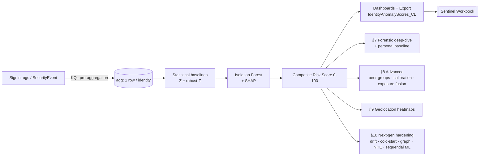

# 🛡️ Identity Anomaly Detection — UEBA Scoring Notebook

> Unsupervised, explainable **User & Entity Behavior Analytics (UEBA)** for Microsoft Sentinel — a lake-first batch scoring engine that turns raw `SigninLogs` into a ranked, analyst-ready risk queue. 


## ✨ Why this exists

Native Sentinel UEBA is great, but it's a black box and stops at the platform edge. This notebook gives a SOC a **transparent, tunable, self-hostable** identity-risk engine that:

- Does the heavy lifting in **KQL** (lake-first), so Python only scores compact aggregates — cheap and fast.
- Scores every identity with **unsupervised ML + statistical baselines + rules** — every flag is explainable.
- Exports a compact table (`IdentityAnomalyScores_CL`) that drives a companion **Sentinel workbook**.
- Runs **out-of-the-box on synthetic data** — flip one flag (`USE_SENTINEL=True`) to point at your workspace.

---

## 🧱 Architecture



---

## 🚀 Capabilities

### Core engine (§1–6)
- **Lake-first KQL pre-aggregation** — one compact row per identity; Python never loads raw events.
- **Statistical baselines** — Z-score + robust-Z (median/MAD) per feature; positive-spike focus.
- **Isolation Forest (+SHAP)** — primary multi-dimensional rarity model (top ~2%), scale-invariant, fully attributed.
- **Composite Risk Score 0–100** — tunable weights, 5 severity bands, mirrors the workbook.
- **Fleet dashboards** — severity donut, top-N, activity heatmap.
- **Identity Protection + UEBA corroboration** — risky users, anomaly counts, anomaly-type breakdown.
- **Export** — scored summary → `IdentityAnomalyScores_CL`.

### Forensic deep-dive (§7 / §7b)
- **Hunt any UPN** with an **analyst-chosen window** (`LOOKBACK_DAYS` / `DETECT_DAYS`) — risk gauge, sign-in timeline, geo/app breakdown, daily volume vs failures, first-seen novelty, raw evidence.
- **Personal baseline & deviation** — scores an identity against **its own** history (robust-z of recent days vs personal baseline) — the core insider/compromise signal.

### Advanced detection (§8)
- **Peer-group baselines** (behavioral K-Means), **two-tailed** detection (spikes *and* suppression), **percentile-calibrated `PriorityScore`** + confidence tier, **human-readable SOC narratives**, **exposure fusion** (risky identity × critical asset), **analyst feedback loop**.

### Geolocation (§9)
- World **choropleths** (total & failed sign-ins), point-**density heatmap**, and an **hour × country** matrix exposing off-hours logins from unusual geographies.

### Next-gen hardening (§10)
- **Concept-drift detection** — Population Stability Index (PSI) + weekly-retrain cadence.
- **Cold-start fallback** — thin-history accounts inherit peer/global baselines.
- **Analyst-readable visuals** — 2D UMAP/t-SNE embedding + SHAP beeswarm.
- **Identity–asset graph** — node-link blast-radius for the forensic target.
- **Resource-vector peer clustering** — function-based cohorts (what they access, not how much).
- **Workload / service-account (NHE) baselines** — deterministic low-tolerance thresholds.
- **Active learning** — analyst dispositions retune IsoForest contamination/exclusion.
- **Sequential ML** — Markov event-transition modelling of action chains.

---

## 🧬 Pipeline

| § | Step | Output |
|---|---|---|
| 1 | Extract pre-aggregated features | feature matrix |
| 2 | Z / robust-Z baselines | per-user deviations |
| 3 | Isolation Forest (+SHAP) | anomaly score + drivers |
| 4 | Composite Risk Score 0–100 | severity |
| 5 | Dashboards (donut / top-N / heatmap) | fleet overview |
| 5b | Identity Protection + UEBA anomalies | corroboration |
| 6 | Export `IdentityAnomalyScores_CL` | workbook join |
| 7 | Per-identity forensic deep-dive (analyst-chosen window) | investigation |
| 7b | Personal baseline & deviation (user vs own history) | self-relative anomalies |
| 8 | Advanced: peer-group, calibration, exposure fusion | `PriorityScore` + narratives |
| 9 | Geolocation analysis | choropleths + heatmaps |
| 10 | Next-gen hardening (drift, cold-start, UMAP+SHAP, identity-asset graph, resource-vector peers, NHE baselines, active learning, sequential ML) | resilient UEBA platform |

---

## ⚡ Quick start

```bash
# 1. Install dependencies
pip install scikit-learn pandas numpy plotly
# Optional (graceful fallbacks if absent): UMAP, SHAP beeswarm, country resolution, Sentinel queries
pip install umap-learn shap matplotlib pycountry msticpy

# 3. Open the notebook
code Identity-Anomaly-Detection-Notebook.ipynb   # then "Run All"
```

The notebook runs end-to-end on **synthetic demo data** with three planted outliers, so every chart has something to show.

---

## 🔌 Connect to your Sentinel workspace

In the imports cell, flip the flag and set your workspace:

```python
USE_SENTINEL = True          # query the workspace via MSTICPy
WORKSPACE    = 'your-workspace-name'
```

Each data-loading cell already ships the production **KQL** alongside its synthetic generator — no rewrite needed. The forensic window is fully tunable:

```python
LOOKBACK_DAYS = 30   # total history pulled for an identity
DETECT_DAYS   = 3    # most-recent days compared against the personal baseline
```

---

## 📤 Output → Sentinel workbook

`§6` writes `IdentityAnomalyScores.csv` (and the schema for the `IdentityAnomalyScores_CL` custom table). Push it via the **Logs Ingestion API (DCR)** or the MSTICPy uploader.

---

## 📦 Requirements

| Package | Required | Purpose |
|---|---|---|
| `scikit-learn`, `pandas`, `numpy`, `plotly` | ✅ | core engine + visuals |
| `umap-learn` | optional | 2D UMAP embedding (t-SNE fallback) |
| `shap`, `matplotlib` | optional | SHAP beeswarm (proxy bar fallback) |
| `pycountry` | optional | ISO country resolution for geolocation |
| `msticpy` | optional | live Sentinel queries (`USE_SENTINEL=True`) |

---

## 🗺️ Roadmap

- [ ] Autoencoder sequence model (beyond first-order Markov).
- [ ] Velocity / burst features (rolling 5-min windows) in the KQL extract.
- [ ] Real asset-criticality join (CMDB / Defender exposure) for exposure fusion.
- [ ] Automated weekly retrain + PSI-triggered alerting.
- [ ] Direct DCR push of scores from the notebook.

---

## ⚠️ Disclaimer

Demo data is synthetic. Validate thresholds against your own environment before operational use. 
